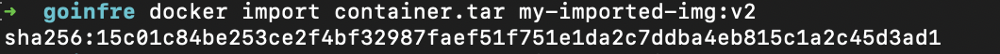
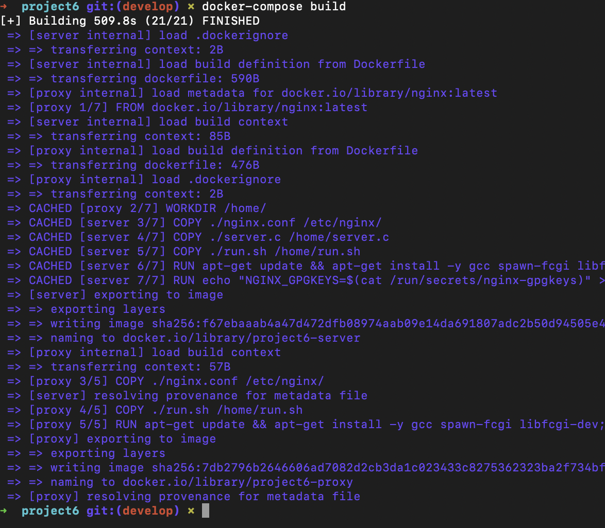

# Simple Docker

## Part 1. Готовый докер

- Возьми официальный докер-образ с nginx и выкачай его при помощи `docker pull`.

- Проверь наличие докер-образа через `docker images`.

- Запусти докер-образ через `docker run -d [image_id|repository]`.

- Проверь, что образ запустился `через docker ps`.

- Посмотри информацию о контейнере через `docker inspect [container_id|container_name]`.

- По выводу команды определи и помести в отчёт размер контейнера, список замапленных портов и ip контейнера.

- размер контейнера

- список замапленных портов

- ip контейнера

- Останови докер контейнер через `docker stop [container_id|container_name]`.
- Проверь, что контейнер остановился через docker ps.

- Запусти докер с портами 80 и 443 в контейнере, замапленными на такие же порты на локальной машине, через команду run.

- Проверь, что в браузере по адресу localhost:80 доступна стартовая страница nginx.

## Part 2. Операции с контейнером

- Прочитай конфигурационный файл `nginx.conf` внутри докер контейнера через команду `exec`.

- Создай на локальной машине файл nginx.conf.
- Настрой в нем по пути /status отдачу страницы статуса сервера nginx.

- Скопируй созданный файл nginx.conf внутрь докер-образа через команду docker cp.

- Перезапусти nginx внутри докер-образа через команду exec.

- Проверь, что по адресу `localhost:80/status` отдается страничка со статусом сервера `nginx`.

- Экспортируй контейнер в файл `container.tar` через команду `export`.

- Останови контейнер.

- Удали образ через `docker rmi [image_id|repository]`, не удаляя перед этим контейнеры.

- Удали остановленный контейнер.

- Импортируй контейнер обратно через команду `import`.

- Запусти импортированный контейнер.

- Проверь, что по адресу `localhost:80/status` отдается страничка со статусом сервера `nginx`.

## Part 3. Мини веб-сервер

- Напиши мини-сервер на C и FastCgi, который будет возвращать простейшую страничку с надписью Hello World!.

- Напиши свой `nginx.conf`, который будет проксировать все запросы с 81 порта на 127.0.0.1:8080.

- Проверь, что в браузере по localhost:81 отдается написанная тобой страничка.

## Part 4. Свой докер

- Напиши свой докер-образ, который:собирает исходники мини сервера на FastCgi из Части 3,запускает его на 8080 порту,копирует внутрь образа написанный `./nginx/nginx.conf`, запускает `nginx`

- Собери написанный докер-образ через docker build при этом указав имя и тег.

- Проверь через docker images, что все собралось корректно.

- Запусти собранный докер-образ с маппингом 81 порта на 80 на локальной машине и маппингом папки `./nginx` внутрь контейнера по адресу, где лежат конфигурационные файлы `nginx'а `
- Проверь, что по localhost:80 доступна страничка написанного мини сервера.

- Допиши в `./nginx/nginx.conf` проксирование странички `/status`, по которой надо отдавать статус сервера nginx.

 - Перезапусти докер-образ.
 
 
 

## Part 5. Dockle

- Просканируй образ из предыдущего задания через `dockle [image_id|repository]`.

 

 - Исправь образ так, чтобы при проверке через dockle не было ошибок и предупреждений.

  

## Part 6. Базовый Docker Compose

- Напиши файл `docker-compose.yml`, с помощью которого:
-  Подними докер-контейнер из Части 5 (он должен работать в локальной сети, т.е. не нужно использовать инструкцию `EXPOSE` и мапить порты на локальную машину).
Подними докер-контейнер с nginx, который будет проксировать все запросы с 8080 порта на 81 порт первого контейнера.

